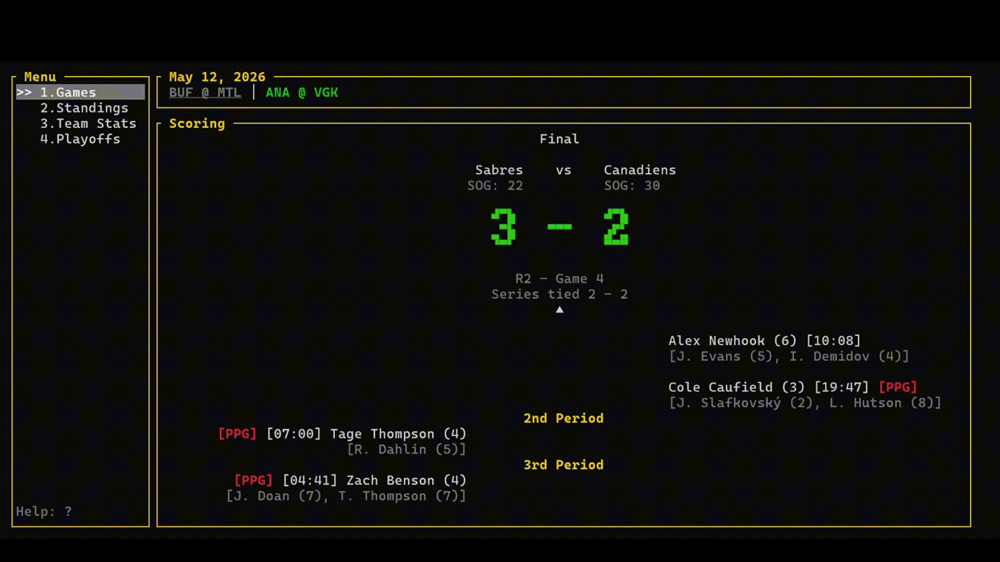

# TNHL

TNHL is a terminal-based NHL data dashboard built with Rust. It provides an interactive TUI for browsing games, standings, player/team stats, and playoff information by pulling data from the NHL API. (See https://github.com/Zmalski/NHL-API-Reference).



## Features

- View daily NHL games (scoring, stats, boxscore)
- Real-time tracking for live games
- Browse league standings
- Explore team scoring and goalie stats
- Display playoff brackets and series details
- Change dates and/or teams directly in the UI

## Installation

Using cargo:

```bash
cargo run
```

## Usage

- `1` – Games
- `2` – Standings
- `3` – Team Stats
- `4` – Playoffs
- `?` – Open help screen
- `Ctrl+c/q` – Quit
