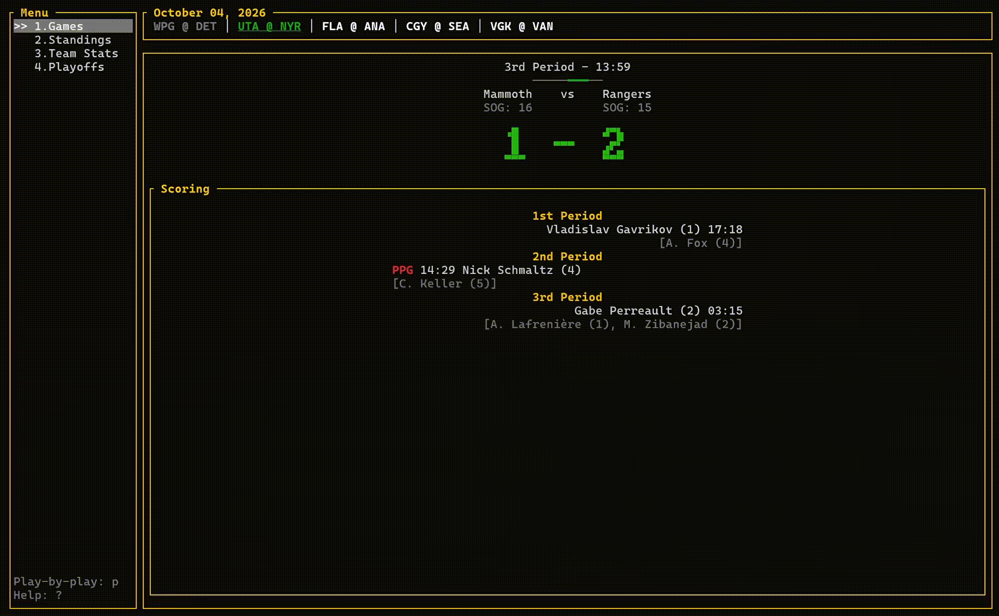

# TNHL

TNHL is a terminal-based NHL data dashboard built with Rust. It provides an interactive TUI for browsing games, standings, player/team stats, and playoff information by pulling data from the NHL API. (See https://github.com/Zmalski/NHL-API-Reference).



## Features

- View daily NHL games: live scoring, boxscores, and team stat comparisons
- Play-by-play feed with an on-ice rink diagram showing where events happened
- Pre-game matchups: team and goalie head-to-head comparisons
- Real-time tracking for live games with adaptive refresh
- Browse league, conference, division, and wild-card standings
- Explore team skater and goalie stats, for the regular season or playoffs
- Display playoff brackets and series details
- Browse past seasons by date or year
- Highlight your favorite team across standings and today's matchups
- Built-in help/keymap screen (press `?`)

## Installation

Using cargo:

```bash
cargo run
```

## Usage

- `1` – Games
- `2` – Standings
- `3` – Team Stats
- `4` – Playoffs
- `?` – Open help screen
- `Ctrl+c/q` – Quit

## Configuration

TNHL reads an optional `tnhl.toml` config file, auto-generated with defaults on
first run. Its location depends on your OS:

- Linux: `~/.config/tnhl/tnhl.toml`
- macOS: `~/Library/Application Support/tnhl/tnhl.toml`
- Windows: `%APPDATA%\tnhl\tnhl.toml`

Available keys:

| Key             | Type   | Default            | Description                                                                                          |
| --------------- | ------ | ------------------ | ---------------------------------------------------------------------------------------------------- |
| `timezone`      | string | `America/Montreal` | Timezone for displayed game start times. Any [IANA tz name](https://en.wikipedia.org/wiki/List_of_tz_database_time_zones) (e.g. `US/Eastern`). |
| `favorite_team` | string | none               | Your team's 3-letter code (e.g. `MTL`, case-insensitive). Becomes the default team on the Team Stats page and is highlighted in the standings and today's matchups. |
| `log_level`     | string | `error`            | Logging verbosity written to `tnhl.log` in your OS data directory: `off`, `trace`, `debug`, `info`, `warn`, or `error`.         |

Example:

```toml
timezone = "US/Eastern"
favorite_team = "MTL"
log_level = "info"
```

## Acknowledgements

TNHL was inspired by [mlbt](https://github.com/mlb-rs/mlbt), a terminal-based
MLB scoreboard also built with Rust and `ratatui`. Thanks to that project for
showing how great a TUI sports dashboard can be.
